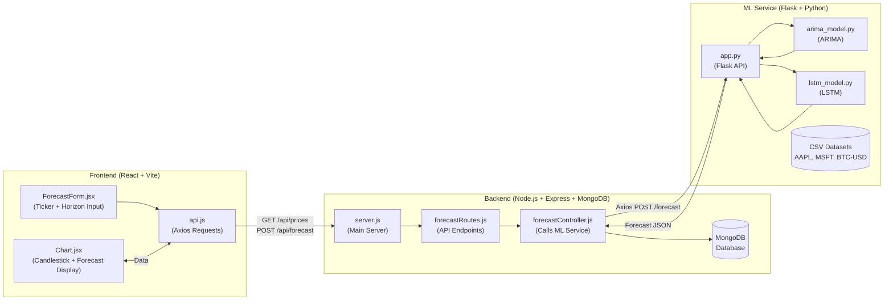

# 💹 FinTech Forecast

A full-stack **financial forecasting web application** that combines structured market data, machine learning models (**ARIMA** & **LSTM**), and an interactive visualization dashboard.

---

## 🧱 Project Overview

FinTech Forecast allows users to:
- View **historical candlestick charts** of financial assets (stocks & crypto).
- Generate **future price forecasts** using both traditional (ARIMA) and neural (LSTM) models.
- Compare forecast results interactively in the web UI.

It integrates three major components:

1. **Frontend (React + Vite)** – Handles user input and visualization.  
2. **Backend (Node.js + Express + MongoDB)** – Manages APIs, database, and communication between frontend and ML service.  
3. **ML Service (Flask + Python)** – Performs forecasting using ARIMA and LSTM models on historical CSV datasets.
 
 
---

## ⚙️ Setup & Run Instructions

> **Requirements:** > Node.js (v18+), Python 3.9+, pip, MongoDB, npm or yarn.

### 1️⃣ Clone Repository
```bash
git clone [https://github.com/Taimoor-Raza-Asif/fintech-forecast.git](https://github.com/Taimoor-Raza-Asif/fintech-forecast.git)
cd fintech-forecast
```

### 2️⃣ Start MongoDB

If you’re using Docker:

```bash
docker run -d -p 27017:27017 --name mongodb mongo
```

### 3️⃣ Run ML Service

```bash
cd ml-service
python -m venv venv
venv\Scripts\activate      # On Windows
pip install -r requirements.txt
python app.py
```

Flask will start on **port 5001**.

### 4️⃣ Seed Database + Run Backend

```bash
cd ../backend
npm install
npm run seed       # Imports Assignment 1 datasets into MongoDB
npm start          # Backend on port 5000
```

### 5️⃣ Run Frontend

```bash
cd ../frontend
npm install
npm run dev
```

Then open your browser at **[http://localhost:5173](http://localhost:5173)**

---

## 🌐 API Endpoints

| Method   | Endpoint                            | Description                              |
| -------- | ----------------------------------- | ---------------------------------------- |
| **GET** | `/api/prices?ticker=AAPL&limit=200` | Fetch historical OHLCV price data.       |
| **POST** | `/api/forecast`                     | Generate forecasts using ARIMA and LSTM. |

**POST Body Example:**

```json
{
  "ticker": "AAPL",
  "horizon": 5
}
```

**Response Example:**

```json
{
  "ticker": "AAPL",
  "horizon": 5,
  "predictions": {
    "arima_pred": [232.05, 228.94, 229.96, 232.37, 234.44],
    "lstm_pred": [239.56, 239.56, 239.56, 239.56, 239.56],
    "ticker": "AAPL"
  },
  "meta": { "source": "ml-service" }
}
```

---

## 🤖 Machine Learning Models

### 🔹 ARIMA

* Implemented in `ml-service/models/arima_model.py`
* Uses **statsmodels** for autoregressive integrated moving average forecasting.
* Captures short-term linear trends.

### 🔹 LSTM

* Implemented in `ml-service/models/lstm_model.py`
* Built with **TensorFlow/Keras**.
* Learns non-linear temporal patterns and volatility better than ARIMA.

### 📊 Model Comparison

| Model                        | Type        |  RMSE | Remarks                                       |
| :--------------------------- | :---------- | :---: | :-------------------------------------------- |
| **ARIMA (5,1,0)** | Statistical | 37.25 | Moderate accuracy; struggles with volatility. |
| **LSTM (1-layer, 64 units)** | Neural      |  9.53 | Much better at capturing complex patterns.    |

✅ **LSTM outperforms ARIMA** with roughly **75% lower RMSE**, proving better predictive power.

---

## 🧠 Model Training Platform

* Models are **trained locally** within the Flask ML service using Assignment 1 CSV data.
* No Hugging Face or external pre-trained models are used.
* Training happens **on-demand** when a forecast request is made.

---

## 🏗️ Architecture Diagram (Mermaid)



---

## 🧾 Report Contents

Include the following in your submitted report (`report/FinForecast_Report.pdf`):

1. Project architecture diagram
2. Description of ARIMA and LSTM forecasting logic
3. Performance comparison table
4. Screenshots of working web app
5. Short conclusion

---

## 🚀 Future Enhancements

* Add Docker Compose for one-command deployment
* Add caching for repeated forecasts
* Store trained model weights (`.h5`) for reuse
* Integrate evaluation metrics dashboard
* Deploy app on Render / Hugging Face Spaces

---

## ✨ Credits

Developed by **Taimoor Raza Asif**
FAST-NUCES | Software Construction & Deployment
Instructor: **Sir Omer Baig**
Year: **Fall 2025**

---
